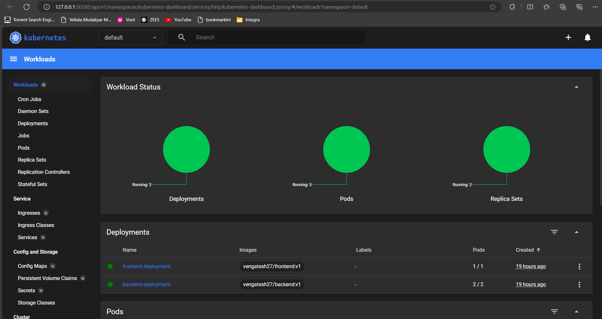
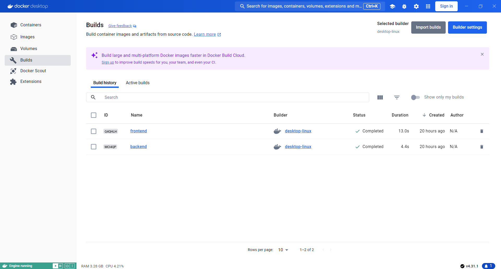
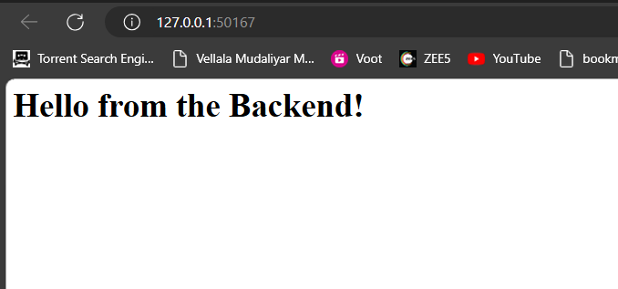
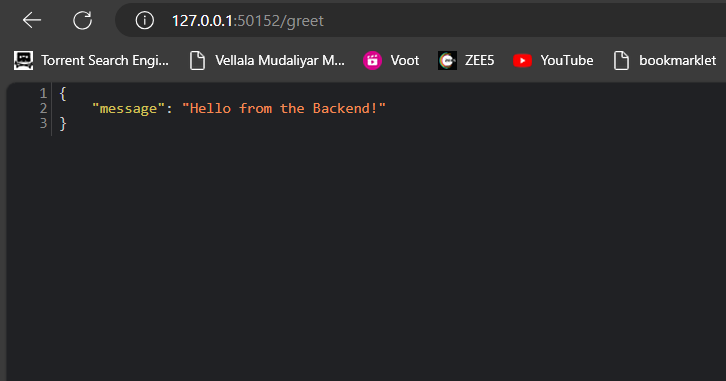

Deploying services to a local Kubernetes cluster such as Minikube involves several steps.

**Prerequisites**
- Install Docker desktopo
- Install Minikube using choco
- Install kubectl cli

**Setup Minikube**
- Start Minikube using below command
    minikube start

**Push Docker Image to Minikube**
- Setup the minikube environment as selected to terminal before build the docker image using below command
    eval $(minikube docker-env)

- Build the docker image to minikube
    docker build -t node-app .

**Kubernetes Deployment and Service**

- Apply these configurations to your Kubernetes cluster using below commands
    kubectl apply -f frontend-deployment.yaml
    kubectl apply -f backend-service.yaml

**Access the application**

- Start the minikube service using below commands
    minikube service frontend-service
    minikube service backend-service

**Debugging commands**
- To view the minikube deployment status
    minikube dashboard

- To view the clusters/pods/services
    kubectl get pods
    kubectl get services

Note: All takes defaut as namespaces

